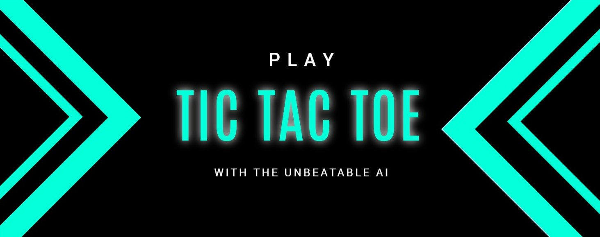
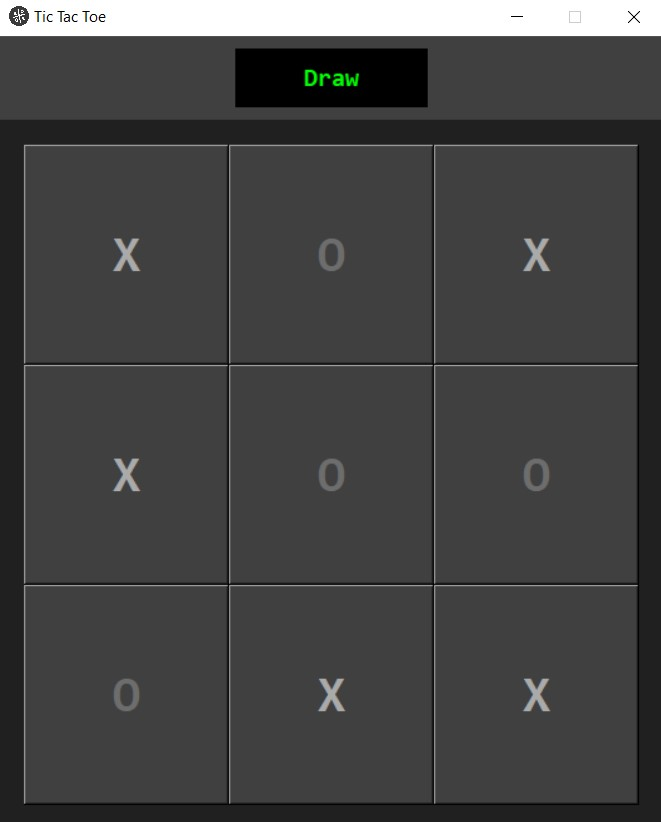
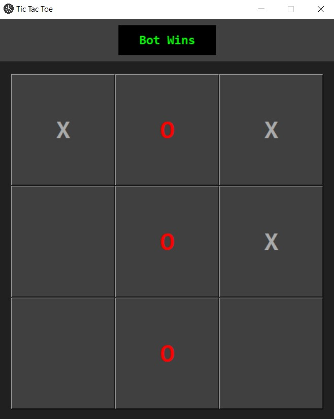
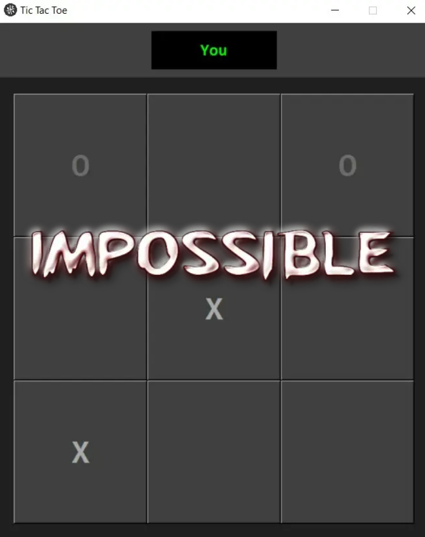

# The Unbeatable TicTacToe

  

## 📄 Description

> A TicTacToe game built in python using tkinter package for GUI. The AI bot in the game is implemented using the Minimax AI Algorithm. The AI searches through all the possibilities (forming a game tree) to find an optimal action. The Minimax Algorithm makes this game unbeatable!

## 👨‍💻 MiniMax Algorithm
> The MiniMax algorithm is a recursive algorithm used in decision-making and game theory. It delivers an optimal move for the player, considering that the competitor is also playing optimally. This algorithm is widely used for game playing in Artificial Intelligence, such as chess, tic-tac-toe, and myriad double players games.
>
> In this algorithm two players play the game, one is called MAX and other is called MIN. Both players try to increase the chances of its wining by assuming that the opponent player plays optimally. The terminal nodes of the game tree, where the game ends, are assigned an utility value, +1 if MAX wins, -1 if MIN wins, 0 if there is a draw. 
>
> The minimax algorithm performs a depth-first search algorithm for the exploration of the complete game tree. The minimax algorithm proceeds all the way down to the terminal node of the tree, then backtrack the tree as the recursion.
>
>  
> 

>   
> 

>  

## 🎮 Game Play
<table style="width:100%">
  <tr>
    <td>Draw match</td>
    <td>Bot Wins</td>
    <td>You Win</td>
  </tr>
  <tr>
    <td></td>
    <td></td>
    <td></td>
  </tr>
</table>

## 🔗 References
- https://www.javatpoint.com/mini-max-algorithm-in-ai
- https://nestedsoftware.com/2019/06/15/tic-tac-toe-with-the-minimax-algorithm-5988.123625.html
- https://people.eecs.berkeley.edu/~russell/slides/chapter05.pdf
